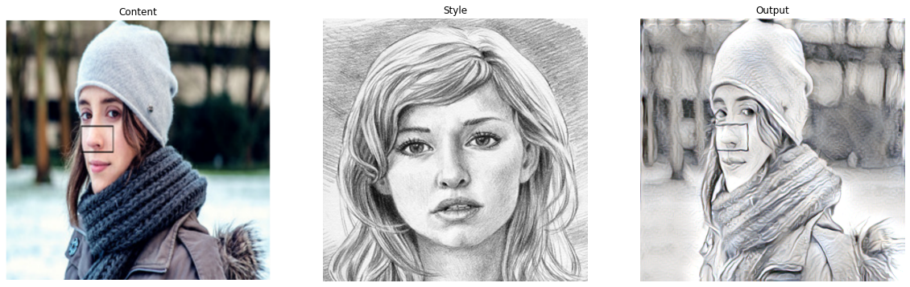

# Style Transfer by Rigid Alignment

This is a pytorch implementation of the paper [Style Transfer by Rigid Alignment in Neural Net Feature Space](https://arxiv.org/abs/1909.13690)

## How To Use

Download the repository into your system

`python styletransfer.py --content path/to/content/image --style path/to/style/image --output path/to/output/image`

### Additional Flags

`--alpha` Choose the value of alpha

`--pretrained_path` Path to pretrained models (The names should be as it is in the pretrained_models directory)

### To Add Additional Style

`--additional_style_flag` Set this to True

`--beta` Choose the value of beta

`--style1` Set the pathe of the additional style image

## Results

